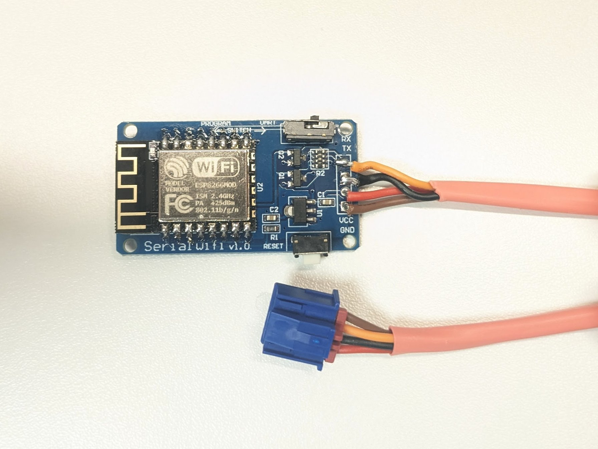
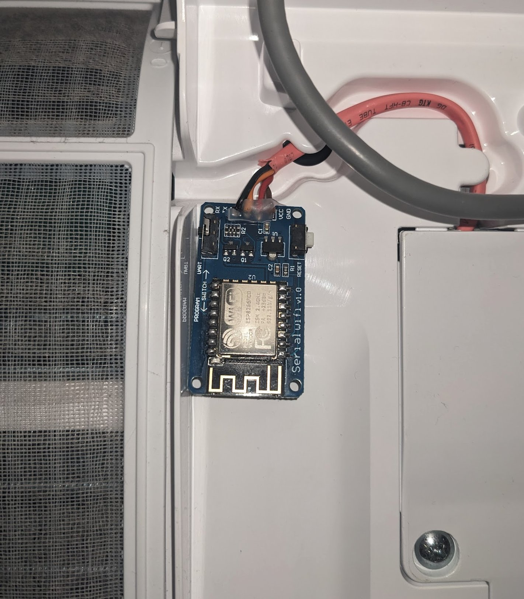

# ESPHome Gree AC Component

**⚠️ WARNING: USE AT YOUR OWN RISK! ⚠️**
**This project can potentially cause permanent damage to your Air Conditioning unit. The authors and contributors provide NO WARRANTY and accept NO RESPONSIBILITY for any damage, data loss, or other issues caused by the use of this software or hardware modifications. ALWAYS disconnect power before working on your AC.**

This repository provides an ESPHome component to interface with Gree-protocol based Air Conditioning units (including Sinclair, Vaillant, Daizuki, and TGM) via their internal serial bus. It allows for full control and monitoring through Home Assistant.

## Features

This component provides a comprehensive set of controls:

*   **Climate Entity**:
    *   Operation modes: Off, Heat, Cool, Dry, Fan only, Auto.
    *   Fan speeds: Auto, Min, Low, Medium, High, Max.
    *   Target temperature control (16-30°C).
    *   Current temperature reporting.
*   **Select Entities**:
    *   **Horizontal Swing**: Various positions and full swing.
    *   **Vertical Swing**: Extensive options for fixed positions and swing ranges.
    *   **Display Mode**: Toggle between showing "Set temperature" or "Actual temperature" on the AC's panel.
    *   **Display Unit**: Celsius (C) or Fahrenheit (F).
    *   **Quiet Mode**: Off, On, or Auto.
    *   **Light Control**: Off, On, or Auto (synchronized with AC power).
*   **Switch Entities**:
    *   **Ionizer (Health)**: Enable/disable the built-in ionizer.
    *   **Beeper**: Enable/disable the AC's confirmation beep for commands.
    *   **Sleep Mode**: Enable/disable sleep timer logic.
    *   **X-Fan**: Keeps the fan running after cooling to dry the coil.
    *   **Powersave**: Enable/disable power-saving mode.
    *   **Turbo**: Force maximum cooling/heating.
    *   **I-Feel**: Use the remote's temperature sensor (if supported).

## Supported Devices

The following devices have been reported to work with this component:

*   **Vaillant**: VAI8/5-i
*   **Gree**: Various models (compatible with GRJWB04-J / Cs532ae WiFi modules)
*   **Daizuki**: Various models
*   **TGM**: Various models
*   **Sinclair**: Various models

**Is your device not on the list?** If it works for you, please contribute by adding your model to the list via a Pull Request!

## Hardware & Installation

### Required Parts
To build the interface module, you will typically need:
*   **ESP8266 Module**: [ESP01-M](https://nl.aliexpress.com/item/1005008528226032.html) or [ESP-07 V1.0](https://www.ebay.de/itm/311619662505).
*   **Voltage Level Shifter**: An adapter board for 3.3V ↔ 5V conversion (ESP8266 uses 3.3V, AC bus uses 5V).
*   **Connector**: [JST XARP-04V](https://es.aliexpress.com/item/1005009830663057.html) (4 pins) or a [Gree AC specific cable](https://de.aliexpress.com/item/1005007454451761.html).

### Device Images
| Device Module | Mounted in AC |
| :---: | :---: |
|  |  |

### Wiring
Connect the ESP module to the AC's WiFi module port. Ensure the TX/RX pins are correctly leveled to 5V if required by your AC.

## Sample Configuration

Use the following YAML as a starting point for your ESPHome configuration:

```yaml
substitutions:
  node_name: gree # Use a unique name.
  node_id: Gree_ac    # Use a unique id.
  friendly_node_name: "Gree AC"
  deviceid: gree
  devicename: Kitchen

esphome:
  name: gree
  friendly_name: "Gree AC"

esp8266:
  board: esp01_1m

# Enable Home Assistant API
api:
  encryption:
    key: "[insert yours]"

ota:
  - platform: esphome
    password: "[insert yours]"

wifi:
  ssid: !secret wifi_ssid
  password: !secret wifi_password

  # Enable fallback hotspot (captive portal) in case wifi connection fails
  ap:
    ssid: "Gree Fallback Hotspot"
    password: "[insert yours]"

captive_portal:

# Enable logging
logger:
  baud_rate: 0 # disable LOG output on UART as UART is used for Gree AC unit
  level: VERBOSE

uart:
  tx_pin: 1
  rx_pin: 3
  baud_rate: 4800
  parity: EVEN

external_components:
  - source: github://chkr1011/esphome_gree_ac
    components: [gree_ac]
    refresh: 0s

climate:
  - platform: gree_ac
```

## Credits & Shoutouts

This project is a fork and wouldn't be possible without the initial work of:
*   [@piotrva](https://github.com/piotrva) - Original implementation of the ESPHome Gree component.
*   [@gekkehenkie11](https://github.com/gekkehenkie11) - Significant improvements to fan modes, command reliability, and feature additions.

Special thanks to all contributors who have tested and reported on their specific AC models!
